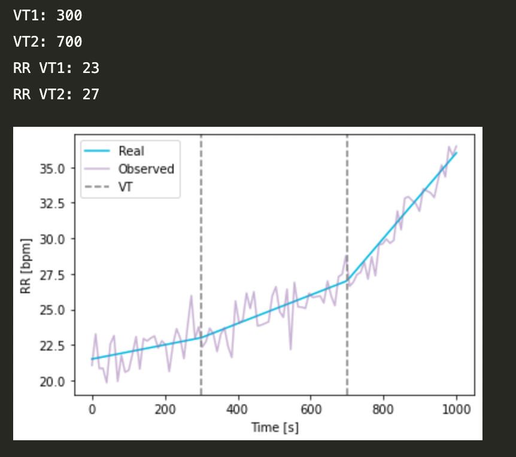

# Data-science Challenge - IC Innovations

## Context

In this challenge you will analyze datasets that contain the time evolution of the physiological variable Respiratory Rate (RR), measured in breaths per minute (bpm) through a ramp test. The respiratory rate of a ramptest can be modeled as a piecewise-linear (3-segment) trend with two breaking points (VT1 & VT2). We are interested in determining the time instant and the respiratory rate where those breakpoints occur, as illustrated in the following image:

## Tasks

1. Dataset
* Dataset can be found [here](data). Dataset provided should be treated as confidential, and should not be distributed.
* Each .csv file corresponds to an indiidual test.
* Each file contains one column with the respiratory rate with a sample time of 6 samples per minute.
* Each filename contains metadata information with the real VT1 & VT2 times and R alongside the level of noise of the signal.

2. Regression analysis
* Implement a segmented regression function: datasets are expected to follow a piecewise-linear (3-segment) trend. To this end, you have to write a function that solves the 3-segment regression. For more info about segmented regression, see this [link](https://en.wikipedia.org/wiki/Segmented_regression) 
* The function should return the fitted model constants ($VT_1 [s],RR_{VT_1}[bpm],VT_2 [s],RR_{VT_2}[bpm]$) and the three correlation coefficients $R_1^2,R_2^2,R_3^2$. 
  
3. Performance Validation
* Validate your function against the metadata of each example
* Analyze how the model performs across different levels of noise

1. Results presentation
* Plot RR [bpm] vs time for both data and model, for the two best and two worst cases
* Generate a histogram for the VT1 and VT2 distributions, indicating in the plot the mean, median, and standard devation for the sample group 
* Report in a plot the $R_1^2,R_2^2,R_3^2$ for each subject (x-data: subject number, y-data: correlation coefficients)
* Be thoughful about visual aspects of the plots such as choice of colors, font size, title and axis lables, legends, etc. Do not include redundant information, be clear and concise. 
* Comment on your results

## Deliverables
* Codes: all code developments must be written in Python language using Jupyter Notebooks, with the requested results clearly reported. you can use a separate .py file for libraries, if you consider it necessary, but the main code should be in a Jupyter notebook. Please send your Jupyter notebook and .py files by e-mail - do not commit them to this repo. Don't forget to comment your codes/notebook
* Presentation: Prepare a PowerPoint/Google Slides presentation that briefly presents the methods for analysis, results, and conclusions. Your audience is the Chief Science Officer of the company. The presentation should contain at most 6 slides, should be written in English (you can present in Spanish), and should be sent by e-mail when you are done with the challenge
